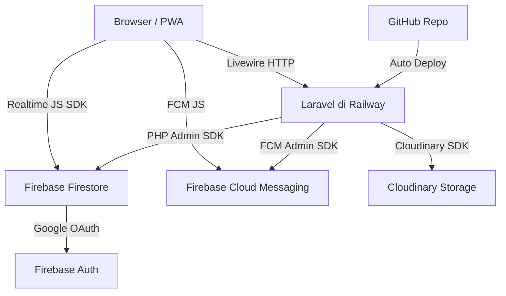

# BDI Apps - Aplikasi Manajemen RT

## Problem Statement
Membangun PWA manajemen RT untuk komunitas kampung, berbasis Laravel + Livewire + Firebase Firestore, dengan struktur hierarki RT → Korwil yang fleksibel, role custom, dan fitur lengkap administrasi warga.

## Requirements
- **Stack:** Laravel + Livewire SPA, Firebase Firestore (PHP SDK + JS hybrid), Cloudinary, FCM Push Notif, Google OAuth
- **Deploy:** Railway (free tier), connect via GitHub
- **PWA:** Installable, offline mode dasar (cache data terakhir)
- **Hierarki:** Superadmin → RT → Korwil (role custom, jumlah tidak terbatas)
- **Auth:** Login Google → default Warga → di-assign Admin/Superadmin. Email di `.env` otomatis jadi Superadmin
- **Fitur:** Manajemen Warga, Iuran & Keuangan, Pengumuman, Surat Administrasi, Keamanan & Ronda, Dashboard per role
- **UI:** Mobile-first design — layout dioptimalkan untuk layar HP, menggunakan Tailwind CSS responsive utilities

## Arsitektur



**Pembagian akses data:**
- **Laravel PHP SDK** → CRUD sensitif (keuangan, surat, user management)
- **Firebase JS SDK** → realtime feed (pengumuman, notifikasi live)

## Struktur Role

```
Superadmin (email di .env)
└── RT
    ├── Pengurus RT (Ketua RT, Sekretaris, Bendahara, dst)
    ├── Korwil A
    │   ├── Role Custom (Ketua, Wakil, Bendahara, Keamanan, ...)
    │   └── Warga Korwil A
    └── Korwil B
        ├── Role Custom (Ketua, Wakil, Bendahara, Keamanan, ...)
        └── Warga Korwil B
```

## Struktur Firestore

```
/users/{uid}                          → profil & role global
/rt/{rtId}                            → data RT
/rt/{rtId}/korwil/{id}                → data korwil
/rt/{rtId}/korwil/{id}/roles/{id}     → role custom
/rt/{rtId}/warga/{uid}                → data warga + role di korwil
/rt/{rtId}/iuran/{bulan}              → tagihan & pembayaran
/rt/{rtId}/pengumuman/{id}
/rt/{rtId}/surat/{id}
/rt/{rtId}/laporan/{id}
/rt/{rtId}/ronda/{id}
```

## Task Breakdown

### Task 1: Setup Project & PWA Foundation
- **Objective:** Inisialisasi Laravel, install Livewire, konfigurasi PWA dasar
- **Implementasi:** `laravel new bdi-apps`, install `livewire/livewire`, buat `manifest.json`, `sw.js` minimal, layout utama dengan meta PWA, setup GitHub repo, koneksi Railway
- **Test:** App bisa diakses, prompt "Add to Home Screen" muncul di Chrome
- **Demo:** Landing page bisa di-install sebagai PWA dari browser

### Task 2: Firebase Auth + Google OAuth + Bootstrap Superadmin
- **Objective:** Login Google berfungsi, superadmin otomatis terdeteksi dari `.env`
- **Implementasi:** Setup Firebase project, aktifkan Google provider, Firebase JS SDK untuk login, endpoint Laravel verifikasi ID token → buat session, cek `SUPERADMIN_EMAIL` di `.env` → set role superadmin di Firestore `/users/{uid}`
- **Test:** Login dengan email superadmin → role superadmin. Login email lain → role warga
- **Demo:** Login Google → masuk dashboard sesuai role (superadmin vs warga biasa)

### Task 3: Manajemen Struktur RT & Korwil
- **Objective:** Superadmin bisa buat RT, tambah Korwil, definisikan role custom per Korwil
- **Implementasi:** CRUD RT dan Korwil via Laravel PHP SDK, Livewire component form manajemen, role custom tersimpan di Firestore dengan nama & deskripsi bebas
- **Test:** Buat RT → tambah 2 Korwil → tambah role custom (Ketua, Wakil, Bendahara, Keamanan)
- **Demo:** Superadmin dashboard tampilkan struktur RT → Korwil → daftar role per Korwil

### Task 4: Manajemen User & Assignment Role
- **Objective:** Admin/Superadmin assign warga ke Korwil dan beri role
- **Implementasi:** Daftar user pending, form assign korwil + role, update `/users/{uid}` dan `/rt/{rtId}/warga/{uid}`, Ketua Korwil bisa assign di korwilnya sendiri
- **Test:** User baru login → muncul pending → assign ke Korwil A sebagai Warga → akses berubah
- **Demo:** Flow lengkap onboarding warga baru hingga aktif di korwil

### Task 5: Manajemen Data Warga
- **Objective:** Pengurus input/edit data lengkap warga per korwil
- **Implementasi:** Form data KK + anggota keluarga (NIK, nama, alamat, status hunian), upload foto KTP ke Cloudinary, filter & tampilan per korwil
- **Test:** Input KK dengan 3 anggota, upload foto, data tersimpan dan foto tampil
- **Demo:** Daftar warga per korwil dengan detail KK, anggota keluarga, dan foto dokumen

### Task 6: Manajemen Iuran & Keuangan
- **Objective:** Bendahara catat iuran, lihat status lunas/belum, rekap kas
- **Implementasi:** Generate tagihan iuran bulanan per warga, form catat pembayaran, rekap per korwil dan RT, laporan pemasukan/pengeluaran sederhana
- **Test:** Generate iuran bulan ini → catat pembayaran → cek rekap korwil dan total kas RT
- **Demo:** Dashboard keuangan dengan status iuran per warga (lunas/belum), total kas RT realtime

### Task 7: Pengumuman & Push Notification
- **Objective:** Admin/Pengurus buat pengumuman, warga terima push notif
- **Implementasi:** Form pengumuman + upload gambar (Cloudinary), simpan ke Firestore realtime, FCM broadcast manual, service worker handle notif background, trigger otomatis notif iuran jatuh tempo
- **Test:** Post pengumuman → warga terima push notif foreground & background → klik buka halaman
- **Demo:** Admin post pengumuman → semua warga dapat notif → feed pengumuman update realtime

### Task 8: Surat Administrasi
- **Objective:** Warga ajukan surat, Pengurus proses dengan update status
- **Implementasi:** Form pengajuan (jenis surat, keperluan, upload dokumen ke Cloudinary), workflow status (pending → diproses → selesai), notif otomatis FCM tiap perubahan status
- **Test:** Warga ajukan surat domisili → Pengurus update status → warga dapat notif otomatis
- **Demo:** Warga lihat status surat realtime, Pengurus lihat antrian surat per korwil

### Task 9: Keamanan, Laporan & Jadwal Ronda
- **Objective:** Warga lapor kejadian, Pengurus Keamanan kelola jadwal ronda
- **Implementasi:** Form laporan kejadian (foto Cloudinary, deskripsi), feed laporan realtime via Firestore JS SDK, jadwal ronda mingguan, notif ke petugas keamanan korwil
- **Test:** Submit laporan dengan foto → muncul di dashboard keamanan → jadwal ronda tampil
- **Demo:** Feed laporan kejadian realtime, kalender jadwal ronda per korwil

### Task 10: Dashboard per Role & Offline Mode
- **Objective:** Dashboard relevan per role, app bisa dipakai offline untuk data dasar
- **Implementasi:** Dashboard berbeda per role (Superadmin, Admin RT, Ketua Korwil, Warga), service worker cache halaman & Firestore persistence untuk offline, banner "mode offline"
- **Test:** Matikan internet → data terakhir masih tampil → banner offline muncul
- **Demo:** Install PWA di HP → buka tanpa internet → data warga dan pengumuman terakhir tetap bisa dilihat

### Task 11: Deploy ke Railway
- **Objective:** App live dan bisa diakses publik via Railway
- **Implementasi:** Setup `Procfile`/`railway.toml`, konfigurasi environment variables (Firebase credentials, Cloudinary, FCM, SUPERADMIN_EMAIL), auto-deploy dari GitHub, setup custom domain (opsional)
- **Test:** Push ke GitHub → Railway auto-deploy → app live, login Google berfungsi di production
- **Demo:** App bisa diakses dari URL Railway, install PWA dari HP, semua fitur berjalan di production
